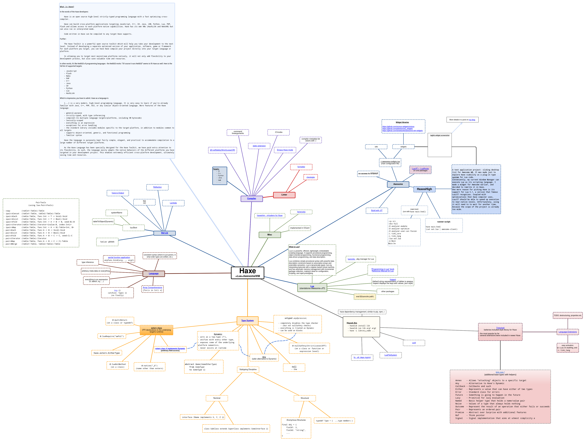

### My Lua config for Awesome WM

Also uses MoonScript and Haxe.

Needs
- date   2.2-2 (installed) - /usr/lib/luarocks/rocks-5.4
- lpeg   1.0.2-1 (installed) - /usr/lib/luarocks/rocks-5.4
- luafilesystem   1.8.0-1 (installed) - /usr/lib/luarocks/rocks-5.4
- luautf8   0.1.3-1 (installed) - /usr/lib/luarocks/rocks-5.4
- luv   1.43.0-0 (installed) - /usr/lib/luarocks/rocks-5.4
- std._debug   1.0.1-1 (installed) - /usr/lib/luarocks/rocks-5.4
- std.normalize   2.0.3-1 (installed) - /usr/lib/luarocks/rocks-5.4

+ whatever is in vendor subdir

#### Haxe mind map / infographic

In SVG:

In PNG:

